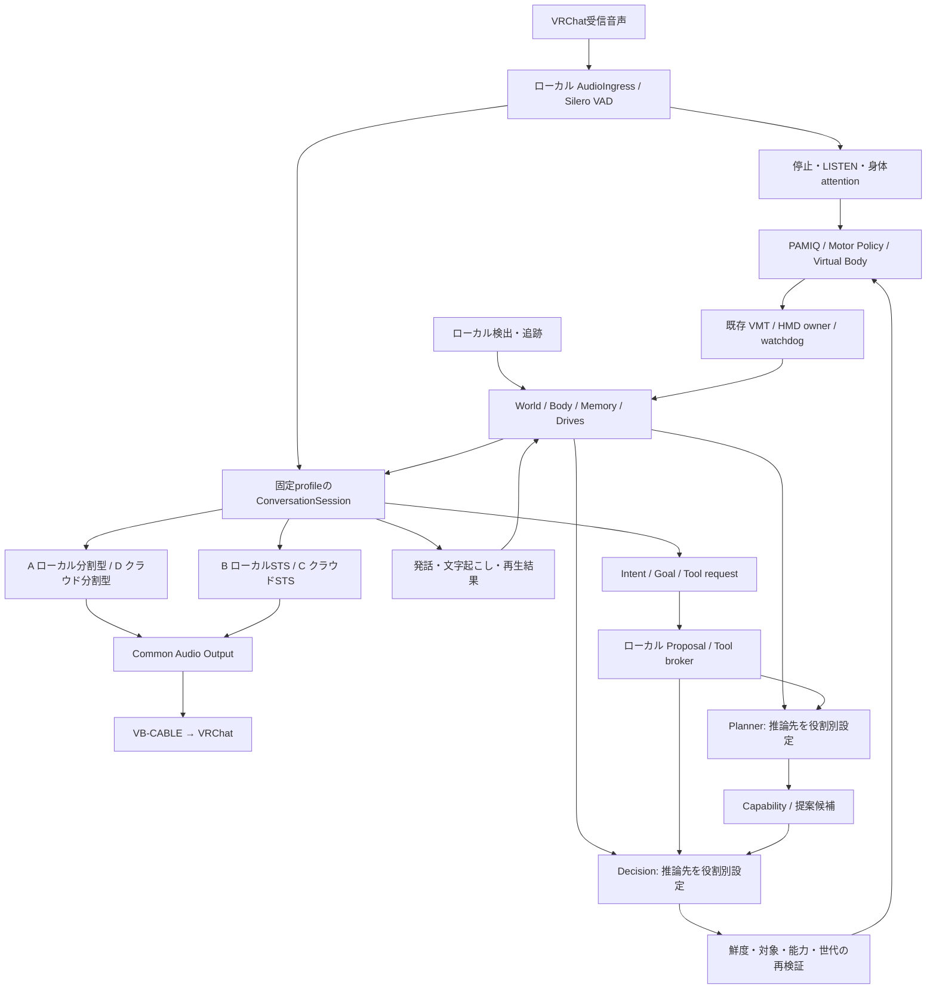

# 判断・会話・音声を交換可能にする設計

全体の所有者・寿命・座標・学習・移行順は
[2026-09-21の統合設計](runtime-redesign.md)を参照。音声の確定入力は返答取消と
独立して保持する実装へ変更した。以下のSession/streaming契約は引き続き提案を含む。
画像の受け渡しと身体要求の採否・実行状態を会話へ戻す実装は
[視界・会話・行動の接続](visual-conversation-actions.md)を参照。

更新日: 2026-09-20。**役割別のローカル／OpenRouter切替と拡張アダプターは実装済み**。
連続音声Session、発話文節streaming、STS統合は引き続き設計段階。
具体的な設定・実装範囲は [モデルとサービスの交換設定](model-adapters.md) を参照。
機種固有の既存計測・評価条件は [端末側の評価メモ](../../MODEL_ADAPTER_ASSESSMENT_20260919.md) に分離する。

## 1. 現在の採用設定と交換方針

2026-09-20の指定に従い、Jevの候補採点とGemma 4の思考を利用する設定を用意する。
会話のAPI設定はGemma 4 31B、ローカル設定はLFM2.5-1.2B-JP-202606。
ローカル思考・候補選択はGemma 4 26B A4Bを設定例とする。Qwen2.5を既定モデルにしない。
性能と資源が足りるローカルモデルを使い、足りない役割へ安価なAPIを挿せるようにする。
`myumiq models init/check`で設定生成・接続確認を行い、任意の対応model/adapterへ交換できる。
APIを必須にも、自動fallbackにもせず、採用構成はrunごとに固定する。

MyuMIQ本体がローカルに保持するものは、WorldState、Working / Episodic / Long-term / Social /
Capability Memory、Goal、Drives、判断・Plannerの実行管理、PAMIQ / Motor Policy、
Virtual Body、watchdog、Learning。
これらの状態・権限・実行周期を会話backendへ移さない。
判断とPlannerの**推論処理**だけは役割別adapterでローカル／APIを選択できる。
未操作時は現在の姿勢を保持し、処理終了やAPI失敗をデフォルト姿勢への復帰理由にしない。

後述のローカル分割音声、STS/Omni、クラウドRealtimeは将来のadapter設計として残す。
それらの再比較を現在の実装・実機試験の前提にしない。
OpenRouterのmodel/provider fallbackは無効にし、モデル・提供先・revision・量子化・
推論runtimeを記録する。再接続は同じbackendに限定する。

会話backendへは必要な現在状態と記憶だけを渡す。出口は会話、任意の高次Intent/Goal提案、
許可したFunction / Tool call。提案はMyuMIQのDecision / Planner / Capability検証を経由する。
会話モデルの自然文を再解釈して身体操作へ直結する旧方式は復活させない。
現在のshared_dialogue.pyは提案を返さないため、提案出口は将来の独立した契約追加として扱う。

## 2. 現状から変えるべき境界

| 現在の実装 | 問題 | 提案 |
| --- | --- | --- |
| 構造化生成設定 | LocalChatとRemoteを暗黙に混ぜない | 実装済み: loopback限定LLMConfig、OpenRouterConfig、installed extensionを役割別に選択 |
| 同ファイルの_request | HTTPをstreamで読むが、APIのstream=trueはなく、全文JSON完成後にparse | 会話はTextDelta→確定した短い発話単位。構造化メタデータは音声開始の後に処理 |
| [shared_dialogue.py](../src/myumiq_vrchat/shared_dialogue.py) | reply/topic/remember_quotes全体を待つ。共有記憶と身体制御の分離はできている | 発話と記憶候補の出口を分離。身体権限を持たない点を維持 |
| [audio.py](../src/myumiq_vrchat/audio.py) のStreamingASR | 実際の契約は音声塊→文字列。名前だけでは継続ストリームを表せない | ASR SessionとTranscriptRevisionを導入し、旧方式はChunkedASRAdapterで包む |
| [conversation.py](../src/myumiq_vrchat/conversation.py) | partialを約0.8秒ごとに再認識し、finalと同じlockを使う | native streaming対応時は再認識不要。chunked方式ではfinal優先、partialを間引く |
| [streaming_tts.py](../src/myumiq_vrchat/streaming_tts.py) | HTTP受信・decode・resample・デバイス再生が一体。固定0.5秒prebuffer | SpeechSynthesizerとAudioSinkを分離。PCM・停止・再生計測を共通化 |
| [embodied_decision.py](../src/myumiq_vrchat/embodied_decision.py) | 約2秒周期。Scorerを呼出しごとに生成・close。候補は既存動作の列挙 | イベントで起動、静かな間は低頻度。Scorer/HTTP接続をworkerの寿命まで保持 |
| [decision.py](../src/myumiq_vrchat/decision.py) | Scorerは既に交換可能。ただしmax選択は不確実・全候補不適切も選ぶ | 独立候補採点を維持し、モデル別校正とabstainを選択側へ追加 |
| Purpose/Memory/Motor | 身体判断と遅い思考の責務を分ける | 実装済み: purpose.plannerは別レーンで目的提案。既存の能力検証後、共有記憶を通して身体判断へ渡す |

今のretrieval rerankerは「文章との関連度」を出す。身体で「今やるべきこと」の正確な確率ではない。
時間的な依頼解決、左右、発話者、既に完了した依頼、姿勢継続を含む評価が必要。
クラウドへ移しても、人物同定・距離・接触観測・Motor学習の不足は解決しない。

## 3. 理想状態のデータフロー



SplitとNativeは選択肢であり、一つのprofileだけが音声出力を所有する。
Omni/Liveに会話用画像を渡す場合も、結果はsource付きの発話・推定・提案として扱い、
ローカルの観測やcanonical WorldStateを無検証で上書きしない。

| 時間軸 | ローカルMyuMIQの責務 | 起動条件 |
| --- | --- | --- |
| 数十ms | capture、VAD、出力停止、身体attention、Motor・lease | ネットワークやASR完了を待たない |
| 数百msを目標 | JEV-like既知候補評価 | 発話確定、対象出現、動作完了、Goal更新 |
| 低遅延で発声開始 | 固定ConversationSessionの入出力管理 | 分割型またはSTSのturn制御 |
| 秒〜十数秒を許容 | Planner、Goal・記憶管理 | 新しい目的、複数手順、不足能力 |
| 非同期 | Learning・replay・Policy評価 | 既存PAMIQの学習・保存機構 |

VAD onsetからTTS停止、LISTEN、既存targetへのattention/LOOK_AT準備を発行する。
発話検出だけでは話者の方向・人物IDを得られないため、対象不明時は架空の相手を選ばない。
安全上の停止やattentionと、意味に基づく新しい身体行動を区別する。
無言時の判断も継続し、同一roleのin-flightは原則1件、待機snapshotは最新1件へ集約する。

## 4. 交換契約

以下は長期的なポート設計。現行実装の型と対応関係は
[モデルとサービスの交換設定](model-adapters.md) に分けて記載する。

| ポート | 入力 → 出力 | 実装候補 |
| --- | --- | --- |
| BodyScorer | DecisionInput → ScoreResult | 既存LocalReranker / HttpScorer。公式JevScorerは任意の比較用 |
| BodySelector | scores + 校正規則 → selected / continue / abstain | ローカル検証。scoreの種類を保持 |
| GoalPlanner | Snapshot + proposals + capabilities → Goal / Plan | ローカルPlanner。Goal状態と採用権限は本体が所有 |
| TextDialogue | DialogueContext → SpeechTextChunk / DialogueMetadata / 任意Proposal・ToolRequest | LFM等のLocalChat / OpenRouterChat |
| ASRSession | push_audio / finish_turn → TranscriptRevision | QwenASRLocalStreaming / FasterWhisperChunked / DirectStreamingASR |
| SpeechSynthesizer | 確定済みSpeechTextChunk → AudioChunk | KokoroLocal / QwenLocal / ApiTTS |
| RealtimeDialogueSession | audio + context updates ↔ ConversationEvent | MoshiLocal / GeminiLive / OpenAIRealtime |
| ProposalToolBroker | IntentProposal / GoalProposal / ToolRequest → accepted / rejected / pending / result | ローカル検証・Decision/Planner/Capabilityへの配送 |
| AudioSink | AudioChunk → PlaybackProgress / stopped | Common Audio Output。全profile共通のPortAudio/Cable出力 |

外側のConversationSessionは両方式で次を提供する。

```text
open(config, capabilities, initial_context)
push_audio(frame)
update_context(snapshot_delta)
events() → speech_started / transcript / output_text / output_audio /
           intent_proposal / goal_proposal / tool_request /
           playback_progress / turn_done / usage / error
submit_tool_result(call_id, status, result)
interrupt(turn_id, reason)
close()
```

分割型だけがASR/TextDialogue/TTSを組み立てる。STSに架空のASR・LLM・TTS段階を作らない。
Nativeの音声を別の会話LLMにもう一度返答させたり、その上にTTSを重ねたりしない。

既存の独立候補採点と、LLMが一度にIDを選ぶ方式は意味が違う。
後者を試すなら別のSelection契約として扱い、勝者だけ1・他0という偽のscoreを生成しない。
Scorer間のrelevance_logitとrubric_scoreを同じ閾値で比較しない。
Jevのconfidenceも、VRChatでその行動が成功する確率とは解釈しない。

### 高次Intent・Goal・Functionの契約

提案出口は任意であり、毎回replyにactionを必須化しない。
ConversationSessionは発話生成と独立に、型と世代が確認できた提案を発行する。
任意の会話backendがnative Tool callを持つとは限らないため、
native_function_call / structured_proposal / unsupportedをcapabilitiesで区別する。
対応しないモデルを「共通interfaceがあるから対応済み」としない。

- IntentProposal: proposal_id、turn_id、generation、snapshot_id、skill、target_id、hand、根拠参照。
- GoalProposal: proposal_id、望む結果、任意の手順候補、必要能力、根拠。Goalの保存・進捗はPlannerが行う。
- ToolRequest: call_id、name、arguments、turn_id、generation、deadline、関連proposal_id。
- ToolResult: accepted / pending / rejected / completed / failedと、実観測の根拠。

Tool brokerは登録された関数だけを扱う。例はget_context、query_memory、propose_intent、
propose_goal。LOOK_AT/WAVEという名前のToolを公開する場合も内部では提案として配送する。
schema、対象、能力、epochを検証し、身体動作は独立Decisionと既存実行経路に渡す。
生のjoint/OSC/controller操作や、会話モデルによる直接Memory/Goal書換えは公開しない。
提案受理と身体完了を別の結果にし、backendへも実際のstatusを返す。

call_id/proposal_idと元utterance_idを保存し、transcript起因の判断とTool由来の提案を照合する。
同じ「右手を振って」が2経路に現れても2回実行しない。
音声responseが取消されても、すでに適用した身体行動は消えたことにせず、
その取消可否をMyuMIQ側で判定する。古い世代の未適用提案は破棄し、必要なら新しいsnapshotから再提案する。

### 共通データ

- Envelope: request_id、session_id、turn_id、generation、snapshot_id、memory_revision、deadline_mono。
- Snapshot: world/body/drives/commitment、speaker付きの直近確定発話、進行中・完了済みaction ID。
- Evidence: source、observed_at、confidence、freshness、画像使用の有無。生画像なしを明示する。
- TranscriptRevision: utterance_id、revision、partial/final、speaker_id（不明可）、音声上の開始/終了時刻。
- SpeechTextChunk: utterance_id、segment_index、確定文節、context_revision。未確定tokenをそのまま読まない。
- AudioChunk: stream_id、segment_index、seq、sample_rate、channels、sample_format、音声時刻、PCM。
- Usage: model、provider、model_revision、料金単位、入力/出力/キャッシュ/音声量、推定額と確定額の区別。

内部PCMはfloat32 monoを基本に、sample_rateを必須にする。デバイスnative rateへの変換はAudioSinkで一度行う。
GeminiのPCM16などはadapterが正規化する。デバイス番号・vendorのvoice ID・API responseはcoreへ漏らさない。

### 能力情報と設定

capabilitiesには、入力/出力modality、ja対応、partial、双方向stream、文節追加入力、
キャンセル範囲、音声format、transcript、文脈更新、session再開、schema/Tool対応、
full-duplex可否とtext/audioの対応付け精度を持つ。
宣伝上の「streaming」と、実際のendpointが受ける継続音声/継続textを分けて表す。

設定は固定profile配下にroleごとのprovider/model/revision/runtime/quantization/device/
endpoint/secret_ref/timeout/budget/voiceを持つ。ローカルprofileにAPI鍵は不要。
「同じbase_urlを全モデルに渡す」は採らない。chat、Jev decisions、TTS、STT、Live WebSocketを個別に変換する。
鍵は既存の承認済み認証経路または環境変数から取得する。設定・prompt・telemetryに保存しない。

## 5. 会話を速くする実行規則

**分割型**

ASR finalと並行して必要な記憶を取得し、短いreplyのtext streamを受信する。
ローカル生成iteratorもAPIのSSEも同じTextDeltaへ写像する。
1文節として意味が確定した時点でTTSへ渡す。topic/記憶引用の完成待ちを発声条件にしない。
構造化出力が必要な身体判断は全文のschema検証後にだけ適用する。

固定の「はい」「なるほど」を先に発声して速さを演出しない。応答の最初の意味ある音声を測る。
接続は再利用し、モデルのthinkingは対応APIで明示的に無効または最小にする。
reasoningを出力から隠すだけでは計算時間・課金を抑えたことにならない。

**一体型**

音声入力と文字起こしイベントを受け、共有記憶へ同期する。
身体判断へ渡す発話は原則final。partialは聴取・注視準備など取消可能な用途に限定する。
Session側の会話履歴とSQLiteの確定記憶の二重管理を避けるため、canonicalな履歴はローカルに置く。
再接続時はspeaker・事実の主語・進行中目的・直近確定turnを含む短いcontextで再開する。

Gemini Live / GPT Realtime / 対応するローカルSTSのTool callはProposalToolBrokerへ渡す。
必要な文脈取得と高次Intent/Goal提案を許容し、身体動作はMyuMIQの検証・判断経路を通す。
世界・身体の更新も独立してローカル判断層へ送る。
Liveのinput/output transcriptとAudioSinkの再生時刻は非同期なので、文字起こし全体を「聞かれた発話」としない。

長いsessionでは確定episodeと要約をMyuMIQに保存し、backendへ渡す履歴を制限する。
圧縮で消える前にGoal・未完了Tool・発話済み範囲を記録する。
再接続では進行中Toolの結果を同期し、過去の要求を再実行しない。

**割り込み**

既定のbarge-in policyでは、ローカルVAD onsetを明確な割込みとして次を実行する。
full-duplexの相槌許容profileでは、onsetで身体attentionを即時更新し、割込み判定を満たす場合に同じ停止手順へ進む。

1. generationを更新し、AudioSinkを停止・queue破棄する。
2. adapterへcancelを伝え、受信・合成・推論を可能な範囲で止める。
3. 古いgenerationのtoken/PCM/結果/記憶commitを破棄する。cancel完了をMotorは待たない。
4. 新しい発話を受ける。model側の生成が止まったかは別に記録する。

Common Audio Outputはbuffering、playback、cancel、必要な短いfade、generation ID、
stale破棄、played/unplayedを一元管理する。fadeは停止期限を延ばさない。
ローカルVADを即時トリガーに残しつつ、full-duplex評価では短い相槌と明確な割込みを区別する
interruption policyをprofileに明示する。「話したら常に応答全停止」ではoverlap品質を測れないため、
同じ明確な割込みscenarioと、相槌/overlap scenarioを分けて比較する。

OpenAI RealtimeをWebSocketで使う場合、ローカル出力停止に加え、adapterがresponse取消と
再生済み時間に基づくconversation.item.truncateを扱い、未再生の返答をremote履歴にも残さない。
このvendor固有eventをcoreへ漏らさず、共通PlaybackProgressから変換する。
[Realtimeの割込み・履歴切詰め](https://developers.openai.com/api/docs/guides/realtime-conversations)

cancelの意味を「出力停止」「通信取消」「遠隔計算取消」に分ける。HTTP切断だけで課金停止を保証しない。
bounded bufferを設け、当初は安定動作済みprebufferを基準に、underrun率を測って短縮する。
今回の設計値だけを根拠に0.5秒から小さな値へ一律変更しない。

音声記憶はgenerated / queued / played_local / interrupted / remote_confirmedを区別する。
途中で止まった返答を全文発話済みとして保存しない。文節単位の再生完了を根拠にし、
正確な音声-text alignmentがなければ部分発話の文字位置を推定で断定しない。

## 6. JEV-like判断・視覚・Planner

JEV-likeとは、**既知候補を素早く評価するSystem1の役割**。
既存のLocalReranker等を含む判断層の総称であり、TypeSafeの公式Jev APIの製品名とは区別する。
まず現在のローカル実装が目的を満たすか評価する。公式Jevは必要なら独立した比較runで使う任意候補。

入力はMyuMIQのcanonical stateと候補。stableなskill/target/action ID、依頼の状態、
左右、時刻、完了済みID、source/confidenceを明示し、日本語自然文だけへの依存を減らす。
文脈が必要な日本語の依頼は保持し、構造化すれば意味理解が不要になるとは考えない。
LOOK_AT / LISTEN / WAIT / APPROACH / AVOIDは役割の例であり、
実装・観測・能力前提を満たすものだけを候補にする。未実装のAPPROACH/AVOIDを実行可能としない。
Motorの毎frame制御はこの判断層に渡さない。

会話final・対象出現・action終了で再評価し、推論中の新snapshotは1件だけ保持する。
確定turnはMemoryに残す。現在姿勢の継続、完了済み依頼、action IDを使って重複実行を抑える。
実行直前に対象鮮度、Capability、世代、手動切替を再検証する。
retrieval scoreは行動成功確率ではないため、continue / abstainを含む品質評価を行う。

PlannerはローカルでGoalを保持し、IntentProposal / GoalProposalを採用・拒否・保留する。
会話backendからの提案は根拠の一つであり、Goalの唯一の生成源にはしない。
会話なしでもDrives・観測・既存Goalから計画を継続できる。
通常の短い動作依頼の前に、別の大モデルへ昇格する手順を要求しない。
新能力のLearning / 評価 / 登録は既存の別経路に接続する。

公式Jevを比較する場合はtext-onlyを守り、画像は送らずimage_used=falseを記録する。
英語中心/CJK精度制約を踏まえ、日本語と実行済み依頼の評価を行う。
この比較はA/Cの会話比較とは別に実施し、本体の既定判断モデルや費用に混入させない。
[TypeSafeの入力条件](https://docs.typesafe.ai/concepts/state)

## 7. 将来の音声adapter候補（以前の調査記録）

この節の比較案は現行モデルを決める作業の前提ではない。現在の既定設定は第1節と
[モデル設定](model-adapters.md)を優先する。Realtime/STS等の別方式を追加するときの参考。

モデル対応は公式資料で確認した範囲と、MyuMIQ上の実測を区別する。
重みが読み込めること、ストリーミング可能なこと、VRChatと同時に低遅延で動くことは別の採用条件。
各runでcheckpoint、量子化、runtime、dtype、CPU/GPU配置を固定する。

### A. 完全ローカル分割型

| パーツ | 候補 | 評価上の注意 |
| --- | --- | --- |
| VAD | 既存Silero | クラウドでも維持。onset→身体attentionと出力停止を単独計測 |
| ASR | Qwen3-ASR 0.6B | 日本語とstreaming対応。公式のstreaming経路はvLLM依存で、Windows/2080 Tiでのruntime成立確認が先 |
| 会話 | LFM2.5-1.2B-JP-202606 | 現在のローカル会話用設定。身体判断は別モデル |
| TTS | ローカルKokoro 82M | 日本語voice/G2Pを用い、文節単位で合成・再生。軽いモデルでも文節全体の合成待ちとfirst PCMを測る |

[Qwen3-ASR公式](https://huggingface.co/Qwen/Qwen3-ASR-0.6B) /
[LFM公式](https://huggingface.co/LiquidAI/LFM2.5-1.2B-JP) /
[Kokoro公式](https://huggingface.co/hexgrad/Kokoro-82M) /
[日本語voice](https://huggingface.co/hexgrad/Kokoro-82M/blob/main/VOICES.md)

Qwen3-ASRはspeech_start → partial → finalを共通eventへ写像する。
native streamingが使えないruntimeでは、chunk再認識を別条件として明示する。
faster-whisper smallを現在の基準として保持する。CUDA/dtype/attention/backendの対応を調べ、
BF16や新しいGPU向けkernelを2080 Tiで動く前提にしない。環境変更は今回行わない。

LFM2.5-1.2B-JPを低遅延baselineとして優先するが、既に過去のCPU試験がある。
JP-202606などのrevision違い、旧reply+action形式と今回の任意提案形式を混ぜて採点しない。
1B級で不足する場合は別モデルを別runで比較して採用を決め、実行中に昇格させない。
Memory/Goal/Capabilityの正本と状態更新権限はLFM内部へ持たせない。

KokoroはLLM text stream→意味の確定した文節/短文→合成→Common Audio Outputとする。
characterごとの合成は日本語の読み・韻律を壊しうるので、文節の長さも評価する。
LLMの全文完成を待つ必要はないが、Kokoroの特定実装が文節途中からPCMを出すとは仮定しない。
現在のQwen3-TTS Q4も同じ出力層で比較し、発声開始、反復、EOS/終端検知、取消後の再生を測る。

反復はLLM生成文、adapterの再送、TTS内部、再生queueを別々に照合する。
既存記録ではLLM生成そのものの反復があるため、全てをTTSのEOS問題に帰属しない。

### B. ローカル一体型STS / Omni

| モデル | 役割・公式情報 | MyuMIQの扱い |
| --- | --- | --- |
| Moshi / Moshika | full-duplex音声対話。MoshiのTemporal Transformerは7B、codec等も必要 | 量子化runtimeで2080 Tiの同時稼働条件を満たす場合のみ実験 |
| MiniCPM-o | 2.6/4.5等は画像・音声・textを統合。2.6のリアルタイム音声は英中を明記 | checkpointごとの日本語音声対応とaudio経路の量子化対応を確認。初期本命にはしない |
| Qwen3-Omni 30B-A3B | 日本語音声入力/出力、画像/video/text、streaming | 2080 Ti単体の初期実験対象から外し、機能構成の参考にする |
| LFM2.5-Audio-1.5B-JP | 今回追加確認した小型日本語STS。text/audio交互生成 | Bの追加調査候補。今回の5profileを自動で増やさず、環境成立後に比較枠へ採用可能 |

[Moshi公式](https://github.com/kyutai-labs/moshi) /
[MiniCPM-o 2.6](https://huggingface.co/openbmb/MiniCPM-o-2_6) /
[MiniCPM-o 4.5](https://huggingface.co/openbmb/MiniCPM-o-4_5) /
[Qwen3-Omni公式](https://huggingface.co/Qwen/Qwen3-Omni-30B-A3B-Instruct) /
[LFM日本語Audio公式](https://huggingface.co/LiquidAI/LFM2.5-Audio-1.5B-JP)

Moshi公式PyTorch版は量子化未対応で24GB級GPUを要求し、Windowsは公式サポート外。
別backendの量子化があることだけで日本語・Windows・2080 Tiの成立を保証しない。
標準checkpointと日本語派生版は言語・weight・runtimeを別に評価する。

MiniCPM-oのINT4 weightだけが収まっても、vision/audio部・activation・KV cache・VR描画の余裕が必要。
textモデルだけのGGUF対応をOmni音声全経路の対応とは解釈しない。
Qwen3-Omniはactive 3Bでも全weightの保持またはoffloadが必要。
30Bを単純4bitとしたweightだけでも約15GB相当となるため、11GB単体の低遅延常駐構成には採らない。
CPU offloadでロード可能でも、今回の同時稼働・応答目標を満たす証拠にはならない。

小型日本語STSは既にLFM2.5-Audio-1.5B-JPという候補があるため、
「将来登場するまで存在しない」とは記載しない。
ただしfull-duplex、barge-in、Tool対応、2080 Tiでのdtype/decoder・日本語品質は別途確認する。

### C. クラウドRealtime STS

Gemini Liveを本命比較とし、GPT Realtime mini系を別profileで比較する。
audio in/out・文字起こし・提案・Function callを共通契約へ写像する。
Goal/Memoryはローカルに保存・要約し、sessionへ必要な文脈だけを渡す。
音声transcriptと実際の音声理解は一致を仮定せず、元音声・転記・Intent誤りを区別して採点する。

- [Gemini Live](https://ai.google.dev/gemini-api/docs/live-api):
  既調査のgemini-3.8-live等から、評価時にモデル名と設定を固定。
  ローカルVADを残し、Live側のturn detectionと二重に返答を生成しない。
- [GPT-Realtime-2.1 Mini](https://developers.openai.com/api/docs/models/gpt-realtime-2.1-mini):
  現行mini系の具体的候補。音声/text入出力とFunction callingを確認。
  [旧gpt-realtime-mini](https://developers.openai.com/api/docs/models/gpt-realtime-mini)とは別モデルとして記録する。
  JSON Schema形式のStructured Outputs対応とは別なので、Tool引数をローカルで検証する。

MyuMIQのCommon Audio Outputへ接続する初期案は、両者とも直接APIのWebSocket adapter。
OpenRouterのchat/audio endpointが同じsession契約を提供すると仮定しない。
日本語品質・barge-in・Intent/Tool精度・長時間安定性・総費用で比較し、宣伝値だけで優劣を決めない。

### D. クラウド分割型

現在のAPI分割型はGemma 4 31B会話＋Jev判断＋Gemma 4 26B A4B思考の設定。
ASRとTTSは独立したvoice設定で選ぶ。以下の旧料金表は採用モデルの指定ではない。
text/提案の監査と声の自由度が利点。ASR→text→TTSのqueue・終端・キャンセル管理が増える。

### API候補の参考価格

2026-09-19の公開情報。LLMはUSD/100万token、掲載P50はMyuMIQのE2E実測ではない。
以前調査したAPI候補を参考に残すが、AのローカルKokoroやローカル判断の料金に混ぜない。

| 候補 | 価格・掲載値 | 使う比較 |
| --- | --- | --- |
| [Qwen3 30B Instruct 2507](https://openrouter.ai/qwen/qwen3-30b-a3b-instruct-2507) | DekaLLM $0.09/$0.30、0.36秒/70tps。Nebius $0.10/$0.30、0.29秒/31tps | 以前の参考値、現行既定ではない |
| [Gemini 2.5 Flash-Lite](https://openrouter.ai/google/gemini-2.5-flash-lite) | $0.10/$0.40、AI Studio 0.43秒/102tps | Dの追加比較候補 |
| [Kokoro API](https://openrouter.ai/hexgrad/kokoro-82m) | DeepInfra $0.62/M文字・0.27秒、Together $4・1.11秒 | ローカル版とは別profile |
| [Fish S2.1 Pro](https://openrouter.ai/fish-audio/s2.1-pro) | $15/M UTF-8 bytes・0.25秒 | API TTSの追加比較 |
| [公式Jev](https://openrouter.ai/typesafe/jev-1.13) | $0.042/$0・約0.25秒 | 任意の判断層単独比較 |

同じモデルでも安いproviderと速いproviderの値を組み合わせない。
Kokoroの一覧APIと個別endpointで価格表示が違ったため、
[endpoint別情報](https://openrouter.ai/api/v1/models/hexgrad/kokoro-82m/endpoints)を確認する。
Fishは日本語文字数とUTF-8 bytesを区別する。

OpenRouterのTTSは音声byte streamを返すが、textの継続入力やfull-duplex sessionとは別。
STTもモデル自体のstreaming対応とAPIの継続音声入力対応を区別する。
[OR TTS](https://openrouter.ai/docs/guides/overview/multimodal/tts) /
[OR STT](https://openrouter.ai/docs/guides/overview/multimodal/stt)

## 8. コスト設計

A/BはAPI従量費ゼロ。CPU/GPU使用、VRAM、RAM、電力、準備・保守時間は別に記録する。
C/Dは会話/音声APIの実usageを比較し、ローカルJEV-like判断の費用へ公式Jevの料金を加算しない。

比較用の仮定: 1時間120turn、各turn入力1,500・出力80token、TTSは各80日本語文字。
税・OpenRouter入金手数料等は別であり、実測の利用量を意味しない。

| 要素 | 単純従量概算/時 |
| --- | ---: |
| Qwen3 30B会話 / DekaLLM | $0.01908 |
| Gemini 2.5 Flash-Lite会話 | $0.02184 |
| ローカルKokoro | API費 $0 |
| Kokoro API / DeepInfra、9,600文字 | $0.005952 |
| Fish API、9,600文字が全て3bytesと仮定 | $0.432 |

DのローカルASR + Qwen API + ローカルKokoroは、この仮定で会話API費約$0.0191/時。
KokoroもDeepInfra APIへ置き換えた別profileなら合計約$0.0250/時 + ASR等。
前版の約$0.10/時は公式Jev込みの別構成であり、今回の標準構成の価格ではない。
公式Jevを別途比較する際だけ、1,800回/時・各入力合計1,000tokenなら$0.0756/時を別計上する。

Gemini Liveは新規音声入力60分・出力20分を公式表示の約$0.005/分・$0.018/分で計算すると
その部分だけで約$0.66。ただし過去contextの再課金、transcript、画像等を加えた実費を測る。
平均保持音声context 8,000tokenを60turn再投入する単純仮定だけでも、
入力$3/Mなら別に約$1.44となる。新規音声分だけを総時給としない。
[Gemini料金](https://ai.google.dev/gemini-api/docs/pricing) /
[Live課金規則](https://ai.google.dev/gemini-api/docs/live-api/best-practices)

GPT-Realtime-2.1 Miniの公式単価は音声token入力$10/M・cached $0.30/M・出力$20/M、
textは入力$0.60/M・cached $0.06/M・出力$2.40/M。
Geminiと音声token化・cache・履歴計上条件が同じとは限らないため、
単価の比だけで会話1時間の価格差を決めない。旧gpt-realtime-miniともusageを分ける。
[モデル別料金](https://developers.openai.com/api/docs/models/gpt-realtime-2.1-mini)

Live系はcontext圧縮/要約、音声入力方針、予算上限、終了時のusage精算を持つ。
Gemini 3.8 Liveのproactive audio常時有効など、versionごとの違いをadapterで明示する。
session再開だけで料金がリセットされるとはしない。
予算到達時はそのbackendを停止・報告し、別backendへ自動切替しない。
[Gemini session管理](https://ai.google.dev/gemini-api/docs/live-api/session-management)

## 9. 固定profileと障害時の挙動

比較は採用profileを固定する。品質が低い、遅い、予算を超えたときに別モデルへ自動エスカレーションしない。
OpenRouterを使うDではmodelとproviderを指定し、比較用runではallow_fallbacks=false等の
対応設定で意図しない提供先変更を避ける。返却されたmodel/providerも照合する。
endpointがroute固定をサポートしなければその制約を記録し、必要なら直接APIを用いる。
[OpenRouter routing仕様](https://openrouter.ai/docs/guides/routing/provider-selection)

| 障害 | 同じprofile内での処理 |
| --- | --- |
| ローカル判断失敗/期限切れ | 古い結果を適用しない。既存の有限動作→姿勢保持。新鮮な状態で再評価 |
| Chat timeout/429 | 同じbackendで期限内の限定retry、または失敗を報告。別モデルへ切り替えない |
| TTS失敗/途中切断 | 再生済み範囲を記録。全文再生を自動でやり直さない |
| STS切断/GoAway | 同一backendへ再接続。世代更新・古い音声破棄・文脈同期 |
| API予算到達 | 新規API推論を停止。身体・記憶・watchdogを維持し、会話停止状態を報告 |
| Internet停止 | A/Bはネットワーク不要。C/Dの会話は利用不能を明示。ローカル身体制御は継続 |
| 日本語/Intent品質不合格 | 評価結果として残し、次の比較runで別profileを選ぶ |

交換可能とは設定による交換を意味する。通常はsessionを終えて次の採用profileを起動する。
将来、明示的な操作で稼働中に交換する場合も、prepare→能力確認→turn終了/interrupt→
generation更新→所有権切替→旧adapter closeとする。自動routeや途中sessionの無理な移植は作らない。
音声出力ownerは常に一つ。再接続・retryで同じTool/actionを再実行しない。

## 10. 現行モジュールへの接続案

最初に必要なのは少数のtyped Protocolとadapter factoryであり、汎用plugin基盤ではない。

| 現行箇所 | 将来の変更 |
| --- | --- |
| cognition.py / shared_dialogue.py | LocalChat/TextDialogueを分離。任意の型付き提案出口を将来追加。現行Dialogueにactionを混ぜない |
| audio.py / conversation.py | ASR session、TranscriptRevision、ConversationSessionの共通event契約 |
| streaming_tts.py | Common Audio Outputを分離し、KokoroLocal / LocalQwen / STS音声を接続 |
| autonomous_services.py | 固定profileのadapter生成・prepare/close・health。自動エスカレーションなし |
| purpose_runtime.py | 確定発話/再生済みevent・ProposalToolBrokerを接続。Decision/Planner権限をローカルに維持 |
| embodied_decision.py / decision_remote.py | Scorerの寿命、イベント起動、deadline、abstain、接続再利用 |
| agent_memory.py / shared_dialogue.py | speaker・factの主語・utterance/action ID・再生状態を保存 |
| 既存replay/learning | provider情報・判断参照・実行結果を既存transitionへ追加。別replay基盤を作らない |

PAMIQのEnvironment/Agent/Interactionが身体の観測・実行周期を維持する。
DataBuffer/StateStore/Trainerが経験・保存・学習を担う。
外部API sessionはアプリのservice adapterであり、新しいMotor schedulerではない。
既存EventInboxと世代管理を拡張し、PAMIQの並行実行・保存機構を複製しない。
[上流pamiq-core](https://github.com/MLShukai/pamiq-core) /
[上流pamiq-vrchat](https://github.com/MLShukai/pamiq-vrchat)

## 11. 共通評価と採用手順

以下は将来の評価であり、今回モデル起動・ダウンロード・実装はしていない。

1. Aの実行環境成立を確認する。Qwen3-ASR streaming runtime、LFMの正確なrevision、
   Kokoro日本語voice/G2P、dtype、各モデルの常駐量を記録する。
2. 現行構成を対照に、ASR・LLM・TTSを一つずつ交換して原因を分離する。
   Aが成立しない場合は、動くchunked ASR構成を別profileとして明示する。
3. 同じローカルMemory/Goal/Decision/Planner/Motorを用い、AとGemini Liveを本命比較する。
4. GPT Realtime mini系とDを同じ会話scenarioで比較する。
   BのMoshiは2080 Tiでの量子化runtime成立時のみ。ほかのB候補は追加調査枠とする。
5. 結果から採用profileを決める。実行時のエスカレーションは導入しない。

比較の実験条件を揃える:
同じVRChat scene、同じ話者・日本語scenario、同じcanonical記憶snapshot、
同じGoal/Capability、同じ身体判断モデル・Motor、同じ音声device/rate、同じ割込み規則。
A/B/C/Dの会話比較中は公式Jevへの交換を混ぜない。
fixtureと実人の記憶を分離し、各runを同じ初期状態から開始する。

| 評価群 | 測定・採点 |
| --- | --- |
| 発話開始 | acoustic speech start→VAD→身体attention/実行。VAD後だけの値も別記録 |
| 返答開始 | speech end→最初の意味あるPCM→local再生→VRChat相手受聴。P50/P95 |
| 分割型の内訳 | first partial ASR、final ASR、first LLM token、最初の確定文節、first TTS PCM |
| STSの内訳 | 入出力audio/turn/transcript時刻。存在しない内部ASR/LLM/TTS段階はN/A |
| 割込み | 相手speech start→local停止と相手側停止、overlap/相槌での誤停止、stale audio |
| 日本語ASR | CER、固有名詞・否定・左右、partial訂正率。独立ASRがないSTSは対応する転記を別評価 |
| 日本語会話 | 応答妥当性、主語・所有者、反復、根拠のない完了報告、Memory想起 |
| Goal / Intent | 妥当な提案、提案不要時の無出力、取消、完了済み依頼、Capability不足への対応 |
| Function / Tool | 正しいTool/引数、schema合格、実行結果、重複なし。未対応は未対応と記録 |
| 資源 | CPU/GPU使用率、RAM/VRAM peak・常駐、VR同時負荷、Motor周期・watchdog |
| 安定性 | cold/warm、30分〜1時間、underrun、EOS終端、切断/再接続、再発話・二重発話 |
| 費用 | API実usage/実費、ローカル電力・保守は別。新規audio単価だけで時給換算しない |

同じ実入力に対する決定済み正解例に加え、独立した日本語held-out scenarioを用意する。
旧8問の開発用評価だけでLFMを合格にしない。100turn程度を初期目安として、
返答・提案・実際の身体適用・Tool実行・音声到達を別々に採点する。
音声系の提案品質は、身体側で補正された結果だけで測らない。

設計目標（保証ではない）は、VAD検出後のlocal停止P95 100ms以内、
身体判断P50 300ms/P95 800ms以内、発話末尾→意味あるlocal音声P50 800ms/P95 1.5秒以内。
実測が目標に届かないときは工程・資源・品質のtrade-offを記録する。
相手側の受聴はゲームとネットワークを含むため別測定。

採用の優先順位は、発話開始への即時身体反応、返答初動、barge-in、
日本語品質、Memory/Goal統合、Intent/Tool品質。
完全ローカルで十分か、クラウドSTSの品質差が費用に見合うか、Dの分割型が適切かを結果から判断する。
