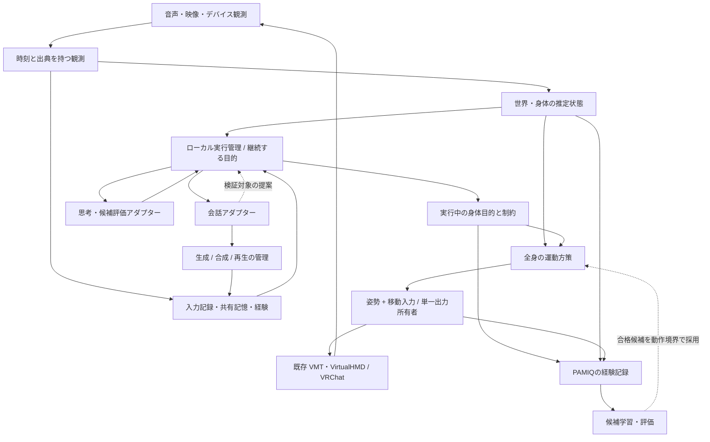

# 継続する目的を持つMyuMIQ：課題と移行設計

更新: 2026-09-21。現行コード・実機記録・添付された実装目標を照合した設計判断。
2026-09-26追記: 会話の身体判断待ちを既定で解除し、会話要求の取消・一文単位送信・
会話中の身体Goal保持を実装した。既存出力supervisorに60Hzの合成処理と
姿勢/移動/手入力の独立leaseを追加した。詳細と未実装範囲は
[多周期構成への移行](architecture.md#multi-rate-migration-2026-09-26)を参照。
続いて通常のcontroller移動を連続lease更新へ変更し、30Hzの加減速と歩行参照への
共有速度要求を実装した。
2026-09-27追記: actorの400ms horizon・関節空間のMotionBuffer、高速視覚追跡を実装した。
自発的な探索の再開と一回だけの命令の重複防止を分離し、身体判断も新発話で取り消せる。
PlannerのTALKは会話アダプターへ渡し、身体Goalを変えずに発話する。
実機受入では人による受聴・外から見たアバター、距離・衝突は別に検証する。
**この文書は目指す構成と移行順を定義する。実装済みの範囲は末尾に明記する。**
個別モデルの性能評価や実機受入の完了を意味しない。
視界と会話・身体判断の接続、要求能力の検証、停止の保持については
[実装した契約と残る制約](visual-conversation-actions.md)を参照。

## 1. 設計の中心

MyuMIQは、共有された記憶・世界の理解・目的を持つ一体のエージェントとする。
会話、身体、知覚、学習は、それぞれ必要な速さで進む。
会話モデルの応答が全体ループの時計になる構成をやめる。

ローカルの実行管理が目的を所有し、モデルは状態を読んで提案する。
会話の取り消しは返答に作用し、入力された発話や身体の目的を消さない。
身体は現在状態から連続的に動き、終了時の既定姿勢への復帰を規則にしない。

モデルの数を増やすことより、所有者・入力の意味・失効条件を明確にすることを優先する。
新しい分散基盤や巨大なイベントフレームワークは追加しない。

## 2. 症状から共通原因へ

| 課題 / 確認できた根拠 | 共通原因 | 設計上の変更 | 確認方法 |
| --- | --- | --- | --- |
| 次の発話で処理中のASR結果と待機音声が消える | 入力と返答の寿命を同じgenerationで管理 | 発話を順序付きで保持。取り消すのは返答だけ | ASRを意図的に遅延させ、連続3発話が順に残ること |
| 古い発言への返答、反応待ちが長い | 入力の因果関係が不明、全文JSON待ち、ASRの遅さ | 入力IDと音声区間、返答対象revision、発話単位streaming | 各段階の時刻と返答対象IDを照合 |
| 観測が一瞬欠けると動作が終わる | 目的の存続と観測鮮度・実行期限が混在 | 目的を維持したまま減速/保持/再観測 | 途中遮蔽→同一対象復帰、期限超過を別々に試験 |
| こちらを向いた後に戻る、小さな動作、つながらない | 有限クリップ・毎回の行動選択・actor追従能力が混在 | 終端保持、継続目的、現在姿勢からの遷移を学習・評価 | 初期姿勢を変えた複数動作の連続試験 |
| 歩行モーションがあるのに実移動は未確認 | 姿勢と移動入力、送信と実際の移動の混同 | 移動方式を明示し、実移動の観測を別に記録 | 送信→受信→VRChat変位の3段階を確認 |
| 判断・Planner結果が頻繁に古くなる | 無関係な更新まで全体generationで失効 | 依存した目的・対象・発話revisionだけを照合 | 身体フレーム更新中でも有効な提案を採用できること |
| 新規モーション登録を習得と呼びやすい | 参照動作の学習と制御モデルの学習が同じ能力状態 | データ登録・actor習得・実機検証を別段階にする | 重み差分、未見遷移、旧技能の維持、実機結果 |

遅延のすべてをモデル性能に帰さない。入力破棄・失効・キュー待ちと推論時間を分離する。
会話の自然さの追求より、聞いた内容に応じて話し、目的を持って動けることを優先する。

## 3. 状態と更新の所有者

| 境界 | 所有するもの | 外部へ渡すもの |
| --- | --- | --- |
| 音声入力 | session、発話ID、音声区間、ASRの暫定/確定結果、欠落情報 | 不変の入力イベント |
| 知覚 | capture時刻・camera pose・座標系付き観測、追跡候補 | 出典と不確かさ付きの観測snapshot |
| 共有実行管理 | 記憶、目的、実行状態、能力、採否の理由 | version付きsnapshotと検証済みGoal |
| 会話実行管理 | 入力revision、返答ID、生成・再生のキャンセル | 発話結果、記憶候補、任意の高次提案 |
| 身体実行器 | 採用されたGoal、継続状態、進捗、運動方策 | ActuationTargetと結果の根拠 |
| 出力supervisor | 所有権、lease、heartbeat、停止、デバイス送信 | 送信・readback結果 |
| 学習 | 経験集合、候補モデル、比較評価、採用manifest | 評価済み候補 |

既存`PurposeRunner`と`AgentMemory`を共有状態の書き込み窓口として徐々に整理する。
身体フレームはDBやHTTPを呼ばず、不変snapshotを読む。モデルworkerは共有状態を書かない。
既存`body_console`と`runtime.py`の二系統を拡張し続けず、最終的に同じ実行契約へ寄せる。
旧経路は移行テスト用に残し、主経路と同じ機能があるとは扱わない。

全履歴を各モデルへそのまま渡さない。同じ根拠から、会話には相手・最近の話・目的・進捗、
判断には現在目的・未完了要求・対象・身体状態・能力、学習には遷移と結果を射影する。
発話の文字列を観測事実や実行済み行為として登録しない。

## 4. 失効と取り消しの規則

| 対象 | 続く期間 | 失効 / 取り消し条件 |
| --- | --- | --- |
| 受信発話 | 確定・記録されるまで | 次の発話では消さない。過負荷・終了による欠落は明示 |
| 暫定ASR | 同じ発話の次revisionまで | 確定・新しい発話で置換可能 |
| 返答 | 対応する会話revisionが有効な間 | 新しい発話・明示停止・出力期限 |
| 目的 | 達成・明示取消・置換まで | 会話終了・API timeout・一時的遮蔽だけでは消さない |
| 実行区間 | 目的に沿う有限の試行 | 進捗なし・実行期限・制約違反。結果を残して再計画 |
| 観測 | センサーごとの許容経過時間 | 古くなった値はunknown。過去の目的は別に保持 |
| 出力lease | 短い更新間隔 | 途絶時に移動入力をゼロ、身体姿勢は既存停止契約で保持 |

モデル要求には`request_id`と、読んだ`goal_revision / input_revision / target_revision`を付ける。
返ってきた提案の依存条件を再検証し、無関係な姿勢更新で破棄しない。
新しいユーザー指示が古い指示を置き換えた場合や対象が別人になった場合は採用しない。
API遅延時に同一roleの要求を積み上げず、進行中1件と次の最新snapshotまでに制限する。
この最新化規則を**確定した入力発話**へ適用しない。

実行の周期も別に持つ。capture/VAD、身体step、出力heartbeatはそれぞれのclockで動く。
共有実行管理はイベントを反映し、モデル要求を非同期に開始する。Plannerや候補評価の
間隔を身体stepの間隔へ流用しない。学習・ファイル保存・モデル切替は身体stepから外す。
profileには各周期・期限・最大待機量を置き、実測の遅れを記録する。単なるtimeout延長を
ASRの遅さ、目標追従不能、目的の継続性に共通する解決策にしない。

## 5. 音声と会話

最小単位は`InputUtterance → Reply → SpeechSegment → PlaybackEvidence`とする。
入力ID、capture区間、確定時刻、モデル/runtime、返答対象、最初の意味ある音声の再生時刻、
再生済みsample範囲と中断位置を結ぶ。生成済み文字列の全体を「相手に話した」としない。
デバイス再生と相手の受聴は別の根拠であり、後者は実機確認が必要。

分割方式はASR・会話生成・TTSを交換可能にし、確定した短い発話単位から合成する。
全文のtopic/記憶候補JSONを待ってから発声する構成を改める。
S2S/Omni方式は会話Session全体のadapterとして接続し、偽のASR/LLM/TTSへ分解しない。
どちらも共通の出力所有者・キャンセル・再生記録を使う。
モデルのtool提案はローカル検証を通し、自然文の「手を振った」を身体操作として解釈しない。

入力キューは有限とし、ASR処理中も次の完成発話を順に保持する。
最初の移行ではメモリー上で保持し、満杯なら新しい区間の拒否を診断へ明示する。
クラッシュや長時間停止も含む保存は、後続で容量・保持期間付き音声spoolとackへ拡張する。
毎フレームの観測や暫定文字列が、確定発話をイベントキューから追い出してはならない。
新しい発話の認識待ちに到着した古い確定結果は記憶へ入れ、古い問いへの返答を再開しない。

## 6. 身体と移動：一つの全身動作として解く

`BodyGoal`は行動名を繰り返し発行する命令ではなく、達成したい条件を表す。
例: 対象へ向く、移動速度・方向、座った姿勢、挨拶の動作、停止後の保持条件。
顔・腕・脚の独立overlayで姿勢を競合させず、身体実行器が互換な条件を一つの全身入力へまとめる。
会話は音声資源を使うため身体と並行できる。座る・歩くなど相反する身体条件は調停する。

今のactorは任意の複合Goalを扱う学習済みモデルではない。
移行初期は対応済みの組み合わせだけ実行し、非対応を明示して順次処理する。
将来のgoal-conditioned actorは、現在姿勢・速度・参照動作・移動要求・対象方向・有効maskを受け、
一貫した関節変化と移動制御を返す。注視をLLMに依存する特別なループにしない。

運動方策の出力と実行境界では、関節制約・速度・床・readbackを検証する。
root旋回を関節のねじれと混同しない。関節範囲を満たすだけで人体やVRChat IKの正しさは証明できない。
終端で現在姿勢を保持する。歩行やジェスチャーの終端条件は動作ごとに指定し、全体のrestに戻さない。

**移動は二つの経路を明示する。**

- controller移動: 速度/旋回要求をスティック入力へ写像する。停止は入力ゼロ。歩行方策へ同じ要求を渡す。
- tracked pose移動: tracking空間でHMD・身体を変位させる。身体オフセットとワールド移動の関係を校正する。

意図しない二重移動を防ぐため、profileで方式を選ぶ。併用は変換と観測が検証された場合に限る。
足踏みは移動の証拠ではない。仮想デバイスの移動量もVRChat root変位の真値にしない。
当面は直進・旋回・停止、次に視覚目標への接近へ進む。未知の距離やcontactに報酬を付けない。
入力とtrackerのAPIはVRChatでも別系統である。[入力](https://docs.vrchat.com/docs/osc-as-input-controller)、
[trackers](https://docs.vrchat.com/docs/osc-trackers)を根拠にadapter境界を分ける。

## 7. 世界の理解と座標

発見、短期追跡、再対応付け、意味理解を区別する。同じentity IDを会話・目的・身体で参照するが、
匿名のvisual trackを検証済みのユーザーIDへ昇格させない。近さだけで話者を確定しない。

座標は少なくとも`image`、`camera_at_capture`、`tracking`、`world_estimate`を区別する。
各観測にcapture時刻と座標系、可能ならcapture時点のcamera poseを付ける。
変換できなければimage上の方向として使い、現在のHMD poseで過去画像を変換しない。
自己旋回による画像変化と対象移動を分け、再同定が不確かな対象を無条件で追い続けない。
距離・床・障害物・接触は観測/推定/予測/不明を区別する。
depthの相対値を校正なしにメートルとして扱わない。

## 8. 交換可能なモデルと実行資源

既存`GenerationConfig` / `AdapterSpec` / `model_profiles.json`を拡張し、別の設定系を作らない。
roleの契約とmodel/runtimeを分ける。ローカル/APIで共通の入力・結果・失敗分類を返す。
起動時にprofileを固定し、暗黙の旧モデルfallbackや会話中のprovider変更を行わない。
認証は環境変数名または外部secret参照だけを設定へ置く。キー値・端末固有パスをrepoへ入れない。

| 役割 | 現行設定・ユーザー指定を活かす方針 |
| --- | --- |
| 会話 | APIのGemma 4 31B、ローカル例のLFM2.5 JPを起点に、指定Gemma 4系列もruntime込みで検証 |
| 思考/目的 | Gemma 4 26B A4B等をrole別に指定。会話コンテキスト・実行権限は独立 |
| 候補評価 | Jevの採点adapterとGemmaの候補ID選択adapterを区別。共通の採否検証へ接続 |
| ASR | Qwen3-ASRのlocal audio-chat adapterと、CPU/GPU指定faster-whisperを設定で交換 |
| TTS | Qwen3-TTS等の生成と明示設定のWindows SAPIを交換可能にし、音声出力の所有・取り消しを統一 |
| S2S/知覚 | 添付候補群は独立adapterとして評価。未検証モデルを既定採用したとは記載しない |

モデルの再選定自体を目的にしない。Qwen2.5のような旧既定へ戻さない。
候補名だけで11GBに収まるとは判断せず、重み・KV cache・VRChat・知覚・音声・学習の同時使用を測る。
`models check`の接続成功と、会話/動作の動作要件合格を別にする。
profileへdevice、runtime revision、量子化、必要機能、上限時間、資源の計測結果を関連付ける。
余力が足りないときは学習を後回しにできるが、会話や身体のために勝手にモデルを置換しない。
完全ローカル版も同じ状態・目的・経験を使う。現行テンプレートは統合性能を保証していない。

## 9. 学習：参照追加から、経験による運動方策の改善へ

VRChatの操作対象は、物理ロボットのトルク制御とは異なる。
学習環境はtracker poseの保持、入力binding、遅延、VRChat IKと移動の観測関係をモデル化する。
何もしなければ保持できる姿勢へ、常時転倒回避の報酬を無理に加えない。

[DeepMimic](https://xbpeng.github.io/projects/DeepMimic/)からは動作模倣とタスク目標を組み合わせる考え方を参照する。
物理シミュレータのaction/rewardをそのまま移植する判断ではない。
PAMIQ VRChatの[サンプル](https://github.com/MLShukai/pamiq-vrchat/blob/main/src/run_sample.py)は
知覚・時間表現・予測モデル・方策を組み合わせる参照になるが、現在の全身actor習得を証明しない。

1. 現在の制約付きactorを基準に、異なる開始姿勢→立つ/しゃがむ/旋回→保持の遷移を評価する。
2. 実機の失敗区間を保存し、模倣による初期学習と、目標達成・連続性・制約に基づく改善を分ける。
3. 最初のRL対象を目標条件付きの小さな運動方策/補正に限定する。既存SAC等の採用は観測・action・報酬の整合確認後。
4. 未見の開始姿勢・動作順序・速度で旧actorと比較する。同じclipの再現精度だけでは採用しない。
5. 実機の限定試験で改善を確認し、manifestを採用して次の動作境界から使用する。劣化候補は不採用にする。

能力状態は`reference_available → actor_validated → live_validated`を別々に管理する。
失敗から新しい練習課題を作ることと、任意の新動作を自動発明できることも区別する。
当面の「勝手に学ぶ」は、許可された動作資料と実機経験から課題を選び、学習・評価・採用を回す意味とする。

PAMIQの`Agent / Environment / Interaction`へ既存I/Oを接続し、`DataBuffer`に実行経験を保存、
`TrainingModel / Trainer`で候補学習と同期を扱う。[上流の構成](https://github.com/MLShukai/pamiq-core)を利用し、
別の学習スケジューラを自作しない。学習用コピーと採用済み推論snapshotを分け、
学習中のパラメータが評価前にlive actorへ流れない同期契約を検証する。
現行body consoleはPAMIQの経験bufferを使う。確定した実機経験から候補を更新する
PAMIQ TorchTrainerも実装済みで、推論用モデルとの同期を持たない候補専用モデルを使う。
この経路は観測開始姿勢からの運動モデル最適化であり、avatarの報酬を使うSAC学習ではない。
既存実行管理が設定済みの経験集合から候補を自動学習・比較できる。
評価を経た実機採用は別段階として扱う。

経験manifestにsession、capture/実行時刻、dt、Goalとrevision、入力ID、座標変換、
要求/制約適用後action、readback、結果の根拠、モデル・rig・profile hashを記録する。
SQLiteは意味・目的・因果関係、PAMIQ bufferは高頻度遷移、外部artifactは音声・画像・重みを担う。
再起動時は目的を再検証し、古い出力leaseや途中音声を自動再生しない。

結果の根拠は、`requested / sent / device_observed / avatar_observed / task_observed`を分ける。
送信成功で到着報酬を与えず、推定関節の制約適合でavatarの自然さを合格にしない。
音声も`generated / submitted / locally_played / remote_confirmed`を分ける。
方策の報酬・能力の採用・会話での成功報告は、同じ根拠の範囲を超えない。

## 10. 段階的な移行と完了判定

| 順序 | 具体的な縦断作業 | 合格条件 |
| --- | --- | --- |
| A | 発話入力と返答取消の分離、順序保持、過負荷の可視化 | 遅いASR中の連続発話が残り、古い返答が再生されず、身体目的が消えない |
| B | 共通再生記録と分割streaming、指定モデル/runtimeの比較 | 実音声30ターンで最終発話→意味ある再生のP50/P95、中断停止時間、取りこぼし数を報告 |
| C | 継続BodyGoalと依存revision、現在姿勢からの遷移 | API待ち・一時遮蔽・会話中にも目的を維持。停止と保持が正しい |
| D | capture pose/座標/対象追跡と実移動の接続 | 直進・旋回・停止の実移動を確認してから目的地試験へ進む |
| E | 経験→actor重み更新→比較→採用 | 実機の失敗を一つ改善し、未見遷移と既存動作を維持。採用理由を再現可能に記録 |

添付目標のP50≤1.5秒/P95≤3秒、割り込み停止P95≤250ms、30分連続稼働、
移動系9/10成功は**受入目標**であり、現時点の計測結果ではない。
既存0.5秒watchdogと手動停止・復帰経路は維持する。
音声の意味、実移動、姿勢、学習改善は別々に合否を出し、平均値で未達を隠さない。

## 11. 今回の実装と検証

段階Aを既存音声pipeline・イベントinbox・共有記憶へ実装した。
確定発話は返答generationと独立に順序保持し、ID・音声区間とともに共有実行管理へ渡す。
古い入力も記録するが、新しい発話の認識中に古い返答を生成し直さない。
キュー容量の超過を明示し、確定入力を暫定イベントに追い出させない。
これはメモリー内の継続性の修正であり、再起動をまたぐ音声spoolやnative streamingではない。

遅いASR中の3発話、キュー満杯、認識失敗、古い入力の記憶と返答抑止、身体目的の保持、
再生直前の割り込み競合を回帰試験に追加した。VRChat稼働中の実収音・出力デバイスを通した
連続入力と割り込み試験も実施した。合成入力・ローカル出力の測定であり、人の受聴評価は別である。

Bの前提として、Qwen3-ASR対応local audio-chatとGPU/CPU指定faster-whisperを設定で選べるようにした。
音声・視覚の構築とASR事前準備は実行管理のpollから分離し、ASR滞留量と待ち時間を表示する。
準備・キャンセル・期限・不正応答を回帰試験で検証。速度の端末別結果はparentの測定記録に置く。
確定音声の認識を速くする変更であり、入力/出力のnative streaming完成を意味しない。
会話には共有記憶の短い射影を渡し、専用のGenerationSessionがHTTP接続を再利用する。
モデルとproviderはrun開始時の設定を維持する。TTSには任意の先頭無音短縮を追加した。
最大除去量を設定し、発声前60msを残し、発声後の休止・サンプル順は変更しない。
既定では無効で、端末と声ごとの確認後に有効化する。再生バッファと割り込み制御は維持する。
Windows SAPIは所有する別プロセスへ隔離し、再生streamの終了はその所有者だけが行う。
割り込み要求は主ループでネイティブ音声の終了を待たず、子の失敗は状態へ明示する。
会話へ渡す直近履歴は共有作業記憶の10発言を維持し、4発言へ再切り詰めしない。

身体ループ内のファイル探索、命令読み取り、停止ファイル確認、受領記録を別workerへ移した。
実行時には元のsession・発行時刻・期限を再確認する。状態表示の保存遅延と身体更新停止を区別する。
Home確認も同時に1件の非同期照会とし、古い確認で移動を続けない。
OpenVRの機器一覧は観測ごとに1回だけ取得し、全tracker間で共有する。観測をまたいだ
身元のcacheは持たず、重複・役割・serialの検査を保つ。

Cの依存関係の一部も修正した。Plannerは手動制御・確定した指示・継続目的のID/状態で失効し、
有限動作の更新や音声の立ち上がりだけでは破棄しない。身体判断は既存動作の完了だけで破棄せず、
採用時に対象と能力、同じ依頼での達成済み記録を照合する。無関係な視覚IDの増減では待機中の
姿勢判断を捨てず、選ばれた対象の鮮度・存在は採用直前に再検証する。新指示は失効条件となる。
新しい明示的な依頼には、繰り返し失敗した動作の有限な再試行を一回許す。
明示的な姿勢指示は共有記憶の制約として保持し、無関係な雑談で自動的に立ち直らない。
静止姿勢は既存誤差以内の新しいreadbackを3点・150ms以上確認して終了し、観測姿勢を保持する。
有限ジェスチャーは全区間の観測と終端安定、周期歩行は別の有限実行期限で管理する。
各参照動作に上限20秒以内の実行期限を指定でき、実行途中で延ばさない。

探索の画像待ちは身体姿勢・実行ID・観測区間を保持し、移動入力を解放する。
中断した移動入力を再送せず、停止・観測を経て次の区間へ進む。元の期限は延長しない。
修正後、実機で移動入力と画像変化の記録を確認した。画像変化だけをワールド変位とは扱わない。
Windows Graphics Captureによるウィンドウ直接取得を選択でき、最前面でない場合も知覚を維持する。
取得時刻を保持し、閉じた・最小化した・更新のない画面を新しい観測として使わない。

Eの候補学習CLIは、実機readbackが確定した経験・一致するactor/rig/decoder・有限な関節推定を
検証する。別sessionを比較評価に使用し、実測trackerと推定骨格の差を運動予測へ保持する。
PAMIQの学習専用モデルはlive推論との同期を持たず、床・到達・既存参照の退行した候補は不採用とする。
更新・比較結果・採否を外部artifactへ保存する。候補更新済みと、実機採用済みを区別する。
繰り返し候補調整に使ったsessionはvalidationであり、最終試験には新しいsessionが必要である。
同じ評価条件で更新幅を有限回だけ半減する設定を追加した。縮小候補ではoptimizer状態も
更新し、PAMIQが保存するsnapshotと候補重みを一致させる。各試行の詳細は別artifactへ保存する。
設定済み参照の自動取得と、経験からのactor候補学習は同じ実行管理の学習枠を順に使用する。

B〜Eの残り、任意の複合Goal、actorの自動採用、候補モデルの全比較は未実装/未検証として残す。
既存の制約付きactor・VirtualHMD/VMT・端末設定を、この設計変更だけで取り換えない。
