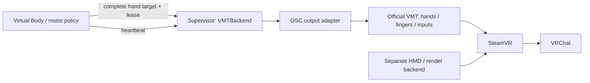

# VMTBackend: lifecycle and supervised OSC output

Status: lifecycle guard, complete OSC sender, independent output process, mock
runtime, and optional OpenVR readback are implemented. Registration and machine
display setup remain external. Exact local evidence belongs in the parent memo.
Passing software/loopback tests does not validate VRChat avatar tracking.

The existing supervisor process now composes output at a nominal 60 Hz. It accepts
`publish_pose(PoseTarget)`, `publish_locomotion(LocomotionCommand)` and
`publish_hands(HandInputCommand)` independently. The canonical commands own tracking
poses, three normalized navigation axes, and remaining controller inputs,
respectively. Navigation owns thumbstick 1; a hand command cannot also claim it.
No controller root translation is added to tracker poses.

Input leases expire after 150 ms (or the configured target timeout if shorter).
Refreshing pose cannot refresh inputs, and input updates cannot renew an old pose.
The complete-frame `publish(BodyTarget)` compatibility method renews both;
existing motor producers still use that method until their own migration.
The compositor's repeated output retains the original pose generation timestamp,
so a stalled producer still reaches the existing target/heartbeat watchdog.
It does not implement motion-horizon interpolation, locomotion smoothing, or an
actor scheduler yet. It adds no output process or VMT writer alongside the
existing supervisor. The physical HMD adapter remains a separate endpoint under
that same owner.

## Boundaries



`VMTBackend[T]` does not define a second body schema. `T` is a complete, immutable,
validated canonical body target, not a delta, OSC message or observed
BodyState. The output adapter validates pose/quaternion bounds, supported
buttons, axes and finger values before any output. It owns conversion from the
canonical frame in `architecture.md`, explicit VMT indices and the Index profile.
The generic guard also retains its original injected-clock lifecycle tests.

HMD/rendering is separate. `DeviceOutput` routes the head to the official
VirtualHMD_OpenVR v0.1 UDP interface, not VMT TrackingOverrides. Null and other
existing HMD candidates are environmental experiments, not custom-driver work.
Do not infer a VMT fault from an invalid HMD render pose.

## Minimal API

| Operation | Contract |
| --- | --- |
| `arm() -> lease` | Explicit startup/recovery. Validate the stop plan, send neutral inputs and stop poses before accepting work. Issue a new unpredictable lease. |
| `heartbeat(lease, sequence, generated_at)` | Renew producer liveness only. Never renew the age of an old target. |
| `submit(lease, sequence, generated_at, target)` | Require a fresh heartbeat; validate the full target, then send it. No cached target replay. |
| `poll() -> Status` | Called independently of incoming messages. Enforce both deadlines and retry stopping at a bounded cadence. |
| `close()` | Latch closed, send neutral and stop even if either fails, then close the output. Idempotent; report failures. |

All calls are serialized by one owner. The class is deliberately not thread safe
and starts no thread. Sequence numbers strictly increase per message stream
(heartbeat / target) within a lease. Timestamps use the same host's monotonic clock
as the supervisor, not wall time or a remote clock. Reject future, expired,
out-of-order and replayed messages without extending either deadline. Use the
generation time, not the time a queued message is finally read, for expiry. Even
within the timeout window, a generation time before the current arm is invalid.

`heartbeat_timeout`, `target_timeout` and `retry_interval` are finite positive
configuration values. Code defaults are illustrative, not measured safe values.
Expire at `age >= timeout`, including a first target that never arrives after arm.
The supervisor must check deadlines before accepting a newly arriving message.
Even a numerically valid message cannot revive an expired lease.

## States and recovery

`NEW -> WAITING -> ACTIVE`. Both startup and explicit re-arm neutralize first.
Heartbeat alone leaves the backend WAITING. A valid full target after a heartbeat
enters ACTIVE. A missing heartbeat **or** a stale target latches TIMED_OUT. Output
failure latches FAULTED; attempt neutral and pose-stop independently even after a
partial target send. `poll` reports faults instead of crashing the monitoring loop.

TIMED_OUT/FAULTED continue to attempt neutral + pose-stop every `retry_interval`.
They do not automatically resume when packets return. An explicit `arm` repeats
startup neutralization and issues a new lease, then requires a new heartbeat and
target. Old leases and queued targets stay invalid. Closing is terminal for that
object and must also run if it never became ACTIVE.

## What must be neutralized

VMT output must be treated as retained state. Every neutralization sends explicit
releases for **all controls the configured profile can drive**, including those
the new producer has not used yet: buttons/click/touch, trigger/grip/force channels,
both joystick/trackpad axes and neutral finger state followed by skeleton Apply.
Never neutralize only the last changed field. Startup must also clear state left
by a previous producer. The serializer tests this inventory against its
normal send path so adding a control also adds its neutral value.

The [official VMT API](https://gpsnmeajp.github.io/VirtualMotionTrackerDocument/api/)
provides the relevant pose, input, skeletal and Reset messages. OSC output belongs
only to the supervisor. A producer that can send OSC directly could continue
overwriting neutral commands after losing its lease; prohibit that path.

## Pose stopping policy

Always send neutral inputs **before** the pose policy, and attempt the pose policy
even if neutralization raises an error.

| Policy | Scope and requirement |
| --- | --- |
| `DISABLE_OWNED` (default) | Disable only explicitly owned VMT devices; preserve unrelated trackers and the separate HMD. Release input first; device disable is not proof that retained inputs were cleared. |
| `SAFE_POSE` | Send only preconfigured, calibrated poses for the owned hands. Never invent a universal origin/head jump; never carry pressed inputs in the safe pose. Missing calibration must fail stop-plan validation before arming. |
| `RESET_ALL` | `/VMT/Reset` affects the VMT instance globally. Require explicit exclusive-instance ownership; reject this configuration otherwise. Never change SteamVR registrations/settings as a stop action. |

The output port validates policy support/ownership/calibration without I/O before
arming. For SAFE_POSE, repeated stop attempts may hold the configured hand poses,
but never reapply the last active target. Canonical curl zero is an open hand;
the VMT scalar adapter sends `1 - curl`, root/wrist, all five fingers, and Apply.
Reset/disable may affect a separately configured VMT head-tracker override; do not
include such a tracker implicitly. Head fallback needs its own validation gate.

## Supervisor and shutdown

PAMIQ `Environment.affect` publishes full targets through authenticated loopback
UDP IPC (bounded datagram size, JSON validation, no network pickle). A separate
supervisor process owns this class and the nonblocking OSC/HMD sockets. Polling
must continue when PAMIQ inference blocks, its interaction pauses, IPC stops or
the producer dies. Heartbeats and targets have independent expiry; a heartbeat
thread cannot keep a frozen motor command alive. Pause/reload invalidates the lease;
resume is an explicit arm with fresh data. Do not persist leases or active inputs
in PAMIQ checkpoints.

The receive timeout is 10 ms and polling occurs before each datagram. Shared
monotonic timestamps use `time.perf_counter` (QueryPerformanceCounter on Windows);
the coarser Python 3.12 Windows `time.monotonic` clock is not used for motor dt.
A live supervisor attempts stopping within the relevant timeout plus scheduling
delay and bounded output-call duration. This is not a hard real-time guarantee.
The output adapter must never block indefinitely. `close` makes one best-effort
neutral/stop attempt and always closes the port, surfacing errors. The process owner
must invoke it from `finally` on normal shutdown/cancellation, and can continue
bounded stopping retries before closing during a planned shutdown.

UDP has no delivery acknowledgement: a successful port call is an attempted send,
not confirmed neutral state. Retrying mitigates packet loss but cannot guarantee
delivery or ordering. A supervisor crash, host suspend, killed process tree or
unavailable SteamVR/VMT can prevent all cleanup. Startup neutralization is required
on recovery; never claim the Python guard alone solves these failures. Validating
independent supervisor survival, IPC backlog handling, actual control release and
device reconnection is required before deployment. No watchdog service is installed
by this slice. On timeout the worker retries for up to two seconds, ignores new
targets, then closes; normal shutdown signals it to neutralize and exit. A new
session is required to re-arm. Pause closes the output; resume fails explicitly.

The concrete shared-instance adapter rejects global Reset even though the generic
guard can model it under exclusive ownership. Its default stop disables only
configured left/right VMT indices and sends a separately calibrated safe head pose
to VirtualHMD. The HMD remains registered: its protocol cannot invalidate pose on
sender death. Failure of either endpoint does not prevent attempts to stop the other.
The live config can explicitly select `safe_pose` instead. It keeps owned hands
connected at the verified neutral pose, including on timeout, while releasing all
buttons, axes, touches and curls. It does not keep an expired action or lease alive.
Readback uses owned serial identity and the driver's role hint; deprecated legacy
role lookup is not the sole liveness signal. Actual game bindings remain a
separate visual gate.

OSC modes 5/6 register Index-compatible hands. Mode 0 at startup does not register
a new device in the inspected v0.15 source. New devices initialize their inputs on
activation; full input frames are sent repeatedly because activation is asynchronous.
The adapter uses `/VMT/Raw/Driver` and never changes RoomMatrix, driver registrations,
power, display settings or VRChat bindings. VMT's own calibration/readback gate still
applies. A pre-existing incompatible VMT device type requires explicit session setup,
not a silent role change by the application.

## Offline validation

With Python 3.12+, from the repository root:

```powershell
python -m pytest -q
```

The original lifecycle tests use a fake clock and retained-state fake output.
Additional tests use ephemeral loopback UDP ports and spawned Python processes,
including an abruptly exiting producer. No SteamVR/VRChat process or driver is
needed. Coverage includes independent deadlines, exact timeout boundaries,
replay/backlog rejection, explicit re-arm, retained input release, each pose policy,
failure during neutral/stop/send/close, retry cadence and idempotent shutdown.
